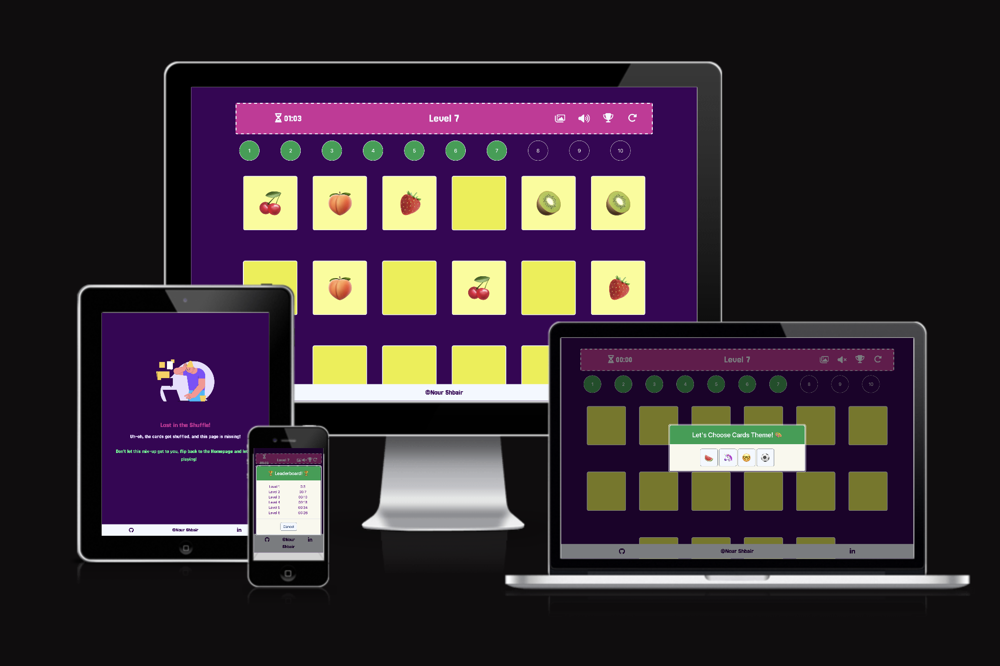
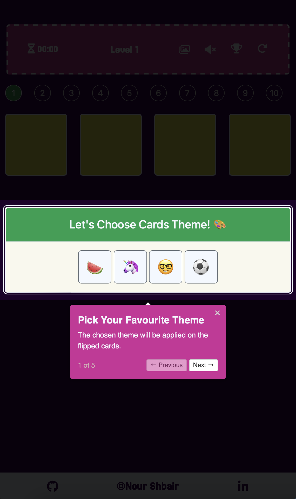
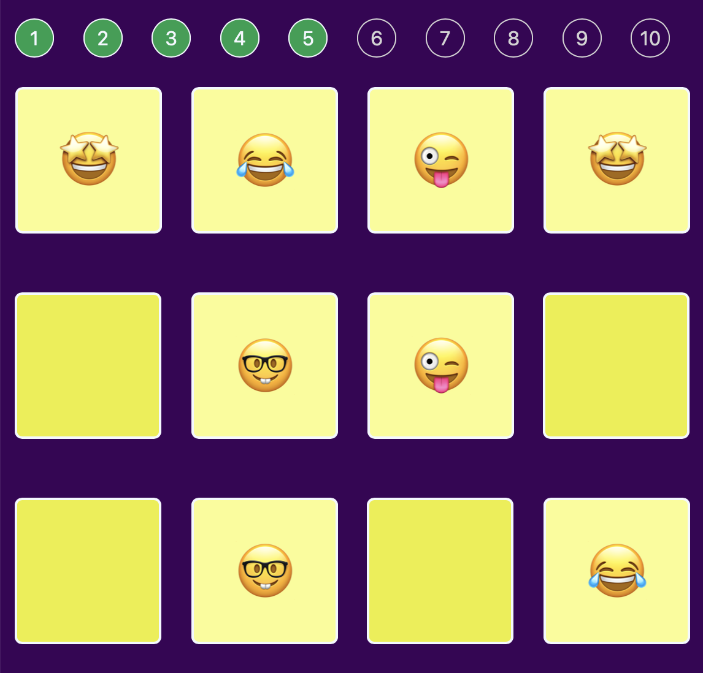
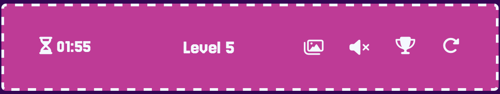
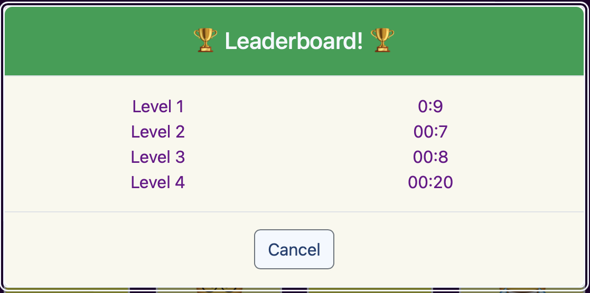
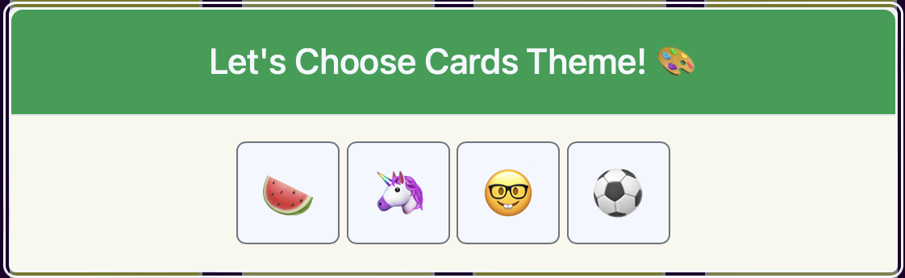
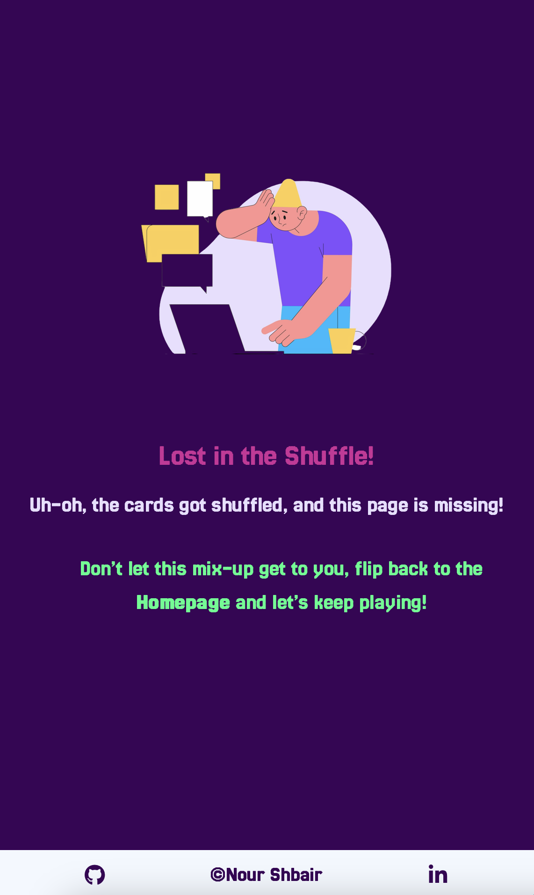

# [MEMORY CARDS GAME](https://nourshbair.github.io/memory-cards-game)

Welcome to **Memory Game**!

Get ready to test your brain and have fun with **Memory Game**, the ultimate memory card game! Whether you’re looking to sharpen your memory skills, challenge yourself with various levels, or just enjoy a few minutes of casual gaming, our game has it all. With an easy-to-learn concept, delightful design, and progressively challenging levels, **Memory Game** is perfect for players of all ages.

Why play **Memory Game**?

**Engaging Gameplay:** Flip, match, and conquer as you work your way through increasingly difficult levels.

**Levels for Everyone:** From beginners to memory masters, there’s a challenge for every skill level.

**Fun and Interactive Design:** Our vibrant graphics and smooth animations make playing enjoyable and immersive.

**Train Your Brain:** Boost your memory, focus, and cognitive abilities while having fun.

Start flipping cards and match your way to victory with **Memory Game**! It’s time to put your memory to the test—can you remember where the cards are?

---
source: [amiresponsive](https://ui.dev/amiresponsive?url=https://nourshbair.github.io/memory-cards-game)

## UX

The design of **Memory Game** is centered around simplicity and fun, with a focus on providing an engaging and enjoyable user experience. Here’s a brief overview of my design process:

**Simple and Colorful Aesthetic:** The overall design is intentionally kept minimal yet vibrant to complement the playful nature of the game. A colorful palette was chosen to make the game visually appealing, ensuring that it matches the energetic concept of flipping and matching cards.

**Home Page (Game Interface):** The home page serves as the core of the game. It features the memory card game in a clean and clutter-free layout. The cards are displayed with enough space between them to avoid confusion, and the simple design keeps the focus on the game itself. Each card flip is animated smoothly to enhance the user experience.

**404 Error Page:** For the 404 page, I designed a fun and lighthearted screen that aligns with the theme of the game. Instead of a generic error page, I created a quirky and colorful message that engages the user and encourages them to return to the game.

**Responsive Design:** The design is fully responsive, ensuring that the game can be enjoyed on different screen sizes and devices, from desktops to mobile phones.

This approach allowed me to create a visually engaging yet simple interface that fits the game’s playful concept while maintaining a smooth and user-friendly experience.

### Colour Scheme

- `#F3F8FF` used for primary text.
- `#EBEE31` used for primary highlights.
- `#390257` used for secondary text.
- `#049F4E` used for secondary highlights.
- `#CF2B9A` used for secondary highlights.

I used [coolors.co](https://coolors.co/e84610-009fe3-4a4a4f-445261-d63649-e6ecf0-000000) to generate my colour palette.

### Typography

- [Jersey 25](https://fonts.google.com/specimen/Jersey+25) was used for all text in the website.

- [Font Awesome](https://fontawesome.com) icons were used throughout the site, such as the social media icons in the footer.

- [Emojipedia](https://emojipedia.org) was used for emoji icons on the cards.

## Features
### Existing Features

- **First-Time User Tour Guide**

    - A step-by-step interactive tour to guide new users through key features and functionalities on their first visit.

- **Memory Card Game with 10 Levels**

    - The core feature of the website is a memory card game where users flip cards and match pairs. The game offers 10 different levels, progressing from easy to hard, providing a challenging experience for users of all skill levels.

- **Timer and Replay Functionality**

    - Each game session includes a timer to track how quickly users can match all pairs. After completing a level, users can replay the game to try and achieve a better time, encouraging them to improve their performance. The best times are stored in the leaderboard.

- **Leaderboard for Each Level**

    - A leaderboard is maintained for each level, displaying the fastest times achieved by users. The leaderboard updates automatically after every successful completion, providing users with a goal to beat the best times.

- **Sound Control**

    - The website includes a sound control feature that allows users to turn the game sounds on or off, with the default setting being off to avoid disturbing users. This ensures a smooth user experience and gives users full control over sound preferences.

- **Customizable Card Themes**

    - Users can select from 4 different card themes to customize their game experience. The available themes include fruits, animals, activities, and smileys, providing a variety of visual experiences to keep the game fresh and engaging.

- **404 Error Page**

    - A custom 404 error page is designed to match the playful, colorful style of the main game interface. This ensures consistency throughout the website, even when users land on an error page, keeping the experience cohesive and enjoyable.

### Future Features
-**Daily Challenges and Rewards**
    - Add daily or weekly challenges with varying levels of difficulty. Completing challenges could unlock rewards like special card themes or badges, giving users additional incentives to play regularly.
- **Social Sharing Features**
    - Enable users to share their leaderboard scores or achievements on social media platforms to engage their friends and create a more social experience.
- **New Game Modes**
    - Add additional game modes like “Time Attack” where users must finish a level within a certain time limit or “Endless Mode” where new cards are continually added as the user progresses.

## Tools & Technologies Used
-  used to generate README and TESTING templates.
-  used for version control. (`git add`, `git commit`, `git push`)
-  used for secure online code storage.
-  used as my local IDE for development.
-  used for the main site content.
-  used for the main site design and layout.
-  used for user interaction on the site.
-  used for hosting the deployed front-end site.
- ⚠️⚠️ CSS FRAMEWORKS: CHOOSE ONLY ONE (if applicable) <-- delete me ⚠️⚠️
-  used as the front-end CSS framework for modern responsiveness and pre-built components.
-  used for the icons.
-  used to help debug, troubleshoot, and explain things.

## Testing
> [!NOTE]  
> For all testing, please refer to the [TESTING.md](TESTING.md) file.

## Deployment
The site was deployed to GitHub Pages. The steps to deploy are as follows:
- In the [GitHub repository](https://github.com/NourShbair/memory-cards-game), navigate to the Settings tab 
- From the source section drop-down menu, select the **Main** Branch, then click "Save".
- The page will be automatically refreshed with a detailed ribbon display to indicate the successful deployment.
The live link can be found [here](https://nourshbair.github.io/memory-cards-game)

### Local Deployment
This project can be cloned or forked in order to make a local copy on your own system.

#### Cloning
You can clone the repository by following these steps:
1. Go to the [GitHub repository](https://github.com/NourShbair/memory-cards-game) 
2. Locate the Code button above the list of files and click it 
3. Select if you prefer to clone using HTTPS, SSH, or GitHub CLI and click the copy button to copy the URL to your clipboard
4. Open Git Bash or Terminal
5. Change the current working directory to the one where you want the cloned directory
6. In your IDE Terminal, type the following command to clone my repository:
	- `git clone https://github.com/NourShbair/memory-cards-game.git`
7. Press Enter to create your local clone.
Alternatively, if using Gitpod, you can click below to create your own workspace using this repository.

Please note that in order to directly open the project in Gitpod, you need to have the browser extension installed.
A tutorial on how to do that can be found [here](https://www.gitpod.io/docs/configure/user-settings/browser-extension).

#### Forking
By forking the GitHub Repository, we make a copy of the original repository on our GitHub account to view and/or make changes without affecting the original owner's repository.
You can fork this repository by using the following steps:
1. Log in to GitHub and locate the [GitHub Repository](https://github.com/NourShbair/memory-cards-game)
2. At the top of the Repository (not top of page) just above the "Settings" Button on the menu, locate the "Fork" Button.
3. Once clicked, you should now have a copy of the original repository in your own GitHub account!

## Credits
### Content
| Source | Location | Notes |
| --- | --- | --- |
| [Markdown Builder](https://tim.2bn.dev/markdown-builder) | README and TESTING | tool to help generate the Markdown files |
| [Bootsrap](https://getbootstrap.com/docs/5.3/components/modal/) | Modal | help in implement interactive pop-up (modal)  |
| [Youtube](https://www.youtube.com/watch?v=IgJnnB1qoeI) | Arrays Concatenation | how to concat two arrays using JS|
| [W3Schools](https://www.w3schools.com/jsref/met_audio_play.asp) | Sound | how to play sound using JS |
| [Codepen](https://codepen.io/moakem/pen/ZyJqmX) | Timer | how to implement timer using JS |
| [W3Schools](https://www.w3schools.com/jsref/prop_win_localstorage.asp) | Local Storage | how to use local storage in JS |
| [FreeCodeCamp](https://www.freecodecamp.org/news/how-to-store-objects-or-arrays-in-browser-local-storage/) | Local Storage | how to store arrays in local storage |
| [DriverJS](https://driverjs.com/docs/confirm-on-exit) | Guide Tour | free library to implement guide tour |
| [Stackoverflow](https://stackoverflow.com/questions/2450954/how-to-randomize-shuffle-a-javascript-array) | Shuffle array | how to shuffle and array in JS |
| [Stackoverflow](https://stackoverflow.com/questions/31566756/animation-flip-div-when-clicked) | Flip Cards Effect | animate cards with flip animation |

### Media

| Source | Location | Type | Notes |
| --- | --- | --- | --- |
| [pixabay](https://pixabay.com/sound-effects/sound-1-167181/) | Home page | sound | flipping cards sound |
| [pixabay](https://pixabay.com/sound-effects/winning-218995/) | Home page | sound | winning sound after each level |
| [Freepik](https://www.freepik.com/free-vector/hand-drawn-flat-design-overwhelmed-people-illustration_24683075.htm#fromView=search&page=6&position=23&uuid=9c7927e5-982e-46b9-938b-d2038ede7638) | Error 404 page | image | page not found image |

### Acknowledgements
- I would like to thank my husband [Ahmad ElShareif](https://www.linkedin.com/in/ahmah2009/), for always believing in me, and encouraging me to make this 'transition' into web development.
- I would like to thank my Code Institute mentor, [Tim Nelson](https://github.com/TravelTimN) for his support throughout the development of this project.
- I would like to thank the [Code Institute](https://codeinstitute.net) tutor team for their assistance with troubleshooting and debugging some project issues.
- I would like to thank the [Code Institute Slack community](https://code-institute-room.slack.com) for the moral support; it kept me going during periods of self doubt and imposter syndrome.