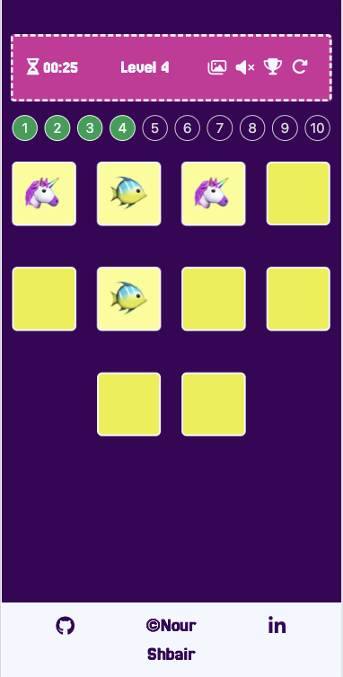
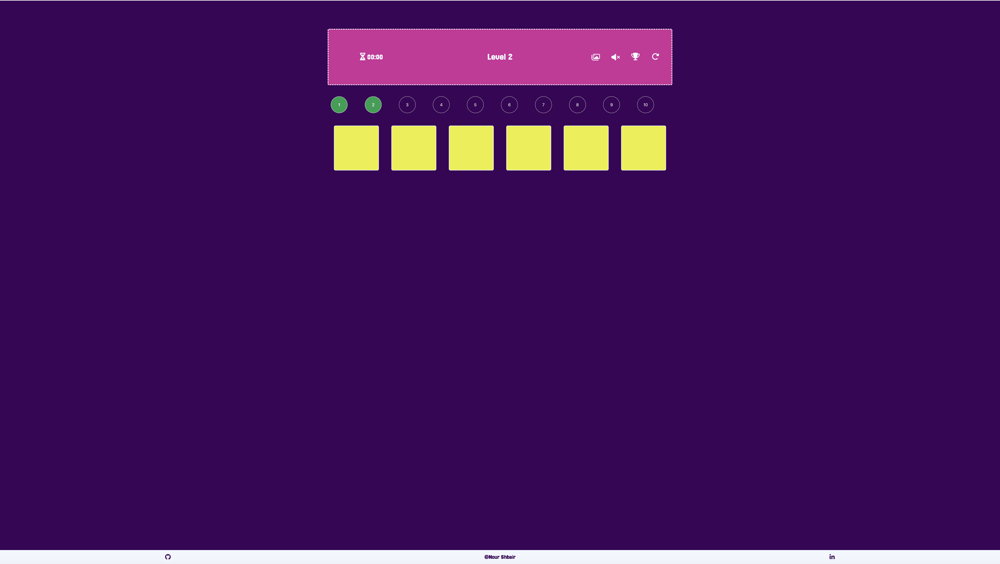
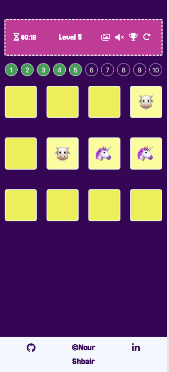

# Testing

> [!NOTE]  
> Return back to the [README.md](README.md) file.

I have thoroughly tested **Memory Game** to ensure its functionality, performance, and usability. This comprehensive process involved examining the website’s reliability and efficiency across multiple platforms, devices, and browsers. By focusing on key aspects of the user experience, I’ve ensured that the site performs smoothly under typical conditions and can handle a variety of user scenarios without sacrificing stability.

As a result of this rigorous testing, I am confident that **Memory Game** is well-prepared, dependable, and ready to meet the needs of its users.

## Code Validation
### HTML
I have used the recommended [HTML W3C Validator](https://validator.w3.org) to validate all of my HTML files.

| Directory | File | Screenshot | Notes |
| --- | --- | --- | --- |
|  | index.html |  | |
|  | 404.html |  | |

### CSS
I have used the recommended [CSS Jigsaw Validator](https://jigsaw.w3.org/css-validator) to validate all of my CSS files.

| Directory | File | Screenshot | Notes |
| --- | --- | --- | --- |
| assets | style.css |  | |

### JavaScript
I have used the recommended [JShint Validator](https://jshint.com) to validate all of my JS files.

| Directory | File | Screenshot | Notes |
| --- | --- | --- | --- |
| assets | script.js |  | |

## Browser Compatibility
I've tested my deployed project on multiple browsers to check for compatibility issues.

| Browser | Home | Error 404 | Notes |
| --- | --- | --- | --- |
| Chrome |  |  | Works as expected |
| Firefox |  |  | Works as expected |
| Safari |  |  | Works as expected |

## Responsiveness
I've tested my deployed project on multiple devices to check for responsiveness issues.

| Device | Home | Error 404 | Notes |
| --- | --- | --- | --- |
| Mobile (DevTools) |  |  | Works as expected |
| iPad (DevTools) |  |  | Works as expected |
| Desktop |  |  | Works as expected |
| XL Monitor |  |  | Works as expected |
| 4K Monitor |  |  | Noticeable scaling issues |
| Google Pixel 7 Pro |  |  | Works as expected |

## Lighthouse Audit
I've tested my deployed project using the Lighthouse Audit tool to check for any major issues.

| Page | Mobile | Desktop | Notes |
| --- | --- | --- | --- |
| Home |  |  | Some minor warnings |
| Error 404 |  |  | Some minor warnings |

## Defensive Programming
Defensive programming was manually tested with the below user acceptance testing:

| Page | Expectation | Test | Result | Fix | Screenshot |
| --- | --- | --- | --- | --- | --- |
| Home | In guide tour, if the user click next, it should bring him to the next step | I tested the feature by clicking on 'Next' button |The feature behaved as expected | Test concluded and passed |  
| Home | In guide tour, if the user click previous, it should bring him to the previous step | I tested the feature by clicking on 'Previous' button on the second step in the tour | The feature has bug, because after the first step in the tour, I hide Theme Modal, and when the user get back to the previous step with hidden modal, it highlights nothing | To fix this issue I add the code shown in the screenshot to let the theme modal be shown again |   
| Home | After lunching the guide tour to the user, it's annoying to appear it again every time the user open the website | I tested the feature by refresh/reopen the website | It shown again at each refresh | I made boolean flag to detect if the tour shown before and store the value in Local Storage to insure that it's value does not change while refresh/reopen the website |  
| Home | In controllers section, the volume must be off by default to prevent annoying the user | I tested the feature by clicking cards |The feature behaved as expected | Test concluded and passed |  
| Home | In theme modal. if the user choose any theme, it should be applied on cards and saved in Local Storage to apply it anytime the user refresh/reopen the website without the need to appear the modal again | I tested the feature by choosing thene and refresh the page |The feature behaved as expected | Test concluded and passed |  
| Home | If the user did not choose any theme, I choose fruits as the default theme | I tested the feature by closing Theme Modal without choosing |The feature behaved as expected | Test concluded and passed | 
| Home | If the user click on Trophy button, it should show Leaderboard Modal and represent the solved levels with the least time achieved | I tested the feature by clicking on Trophy button before start playing and after levels success |The feature behaved as expected | Test concluded and passed |   
| Home | If the user click on Restart button, it should restart the game and reset the timer | I tested the feature by clicking on Restart button while playing |The feature behaved as expected | Test concluded and passed | 
| Home | If the user click on Sound button, it should toogle the state of the sound | I tested the feature by clicking on Sound button (turn on), then click on cards to hear flipping sound, as well hearing the winning sound after successfully finish the level|The feature behaved as expected | Test concluded and passed | 
| Home | If the user click on the card, check if it the first or the second click (per round), then check if they are same or different | I tested the feature by clicking on cards | The feature behaved as expected, but if the two flipped cards are different, they unflipped immediately without letting the user able to see the content of the second card | I made delay with 1 second before unflip the cards |  
| Home | If the user unflip all the cards successfully, Success Modal should appear to bring him to next level, and winning sound should play (if the sound is on) | I tested the feature by successfully win any level | The feature behaved as expected | Test concluded and passed  |   
| Home | After finishing the last level (10), Leaderboard Modal should be shown instead of Success Modal | I tested the feature by winning the last level | It shows Leaderboard Modal but the last level not listed | I fixed the issue by adding condition to check if it is the last level, I hard coded the length of the loop to (10), because it's not a logical approach to increment (highestActiveLevel) to be 11|   
| Error 404 | If the user click on redirect link, it should redirect him to home page | I tested the feature by clicking on the green statement |The feature behaved as expected | Test concluded and passed | 
| All | If the user click on GitHub/Linkedin buttons in the footer, it should open the links in new tab | I tested the feature by clicking on GitHub/Linkedin button |The feature behaved as expected | Test concluded and passed | 
| Home | If the user click on any level button from level bar, it should redirect him to the cliked one | I tested the feature by clicking on any level from the green level buttons | The feature behaved as expected |Test concluded and passed | 
| Home | If the user finished a level again (finished before), Local Storage should store the least time between the current and the stored one for the same level | I tested the feature by achieveing less time in (already-winned) level and check leaderboard modal| The feature behaved as expected |Test concluded and passed | 

## Bugs
- The second card in the round unflipped immediatly if they are not matched.

    

    - To fix this, I made 1 second delay before unflip the cards.

- The leaderboard array in Local Storage store the time for each level even if the user achieved less time success. 

    

    - To fix this, after every success for any level, I compared the stored value for the time with current value and store the least one in the Local Storage.

    

## Unfixed Bugs
- Ghost Exception! I couldn't re-generate the senario.

    

    - Attempted fix: when I cleared the local storage and refresh the page, it works fine. And to solve this I need to investigate the case and its related code.

> [!NOTE]  
> There are no remaining bugs that I am aware of.
